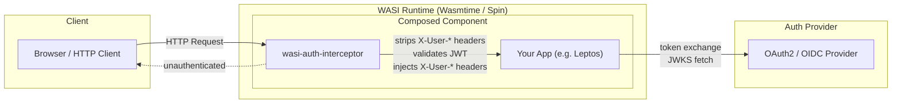

# WASI Auth Middleware

A modular, WebAssembly-compatible (WASI Preview 2) authentication framework for Rust.
Provides JWT session management, OAuth2/OIDC client logic, email OTP flows, and a
composable HTTP proxy middleware — all targeting `wasm32-wasip2`.

## Architecture



### Request Flow

1. **Incoming request** hits the `wasi-auth-interceptor` component
2. **Header stripping** — all `X-User-*` headers are removed to prevent spoofing
3. **Public path bypass** — requests to `/`, `/login`, `/pkg/*`, `/static/*` are forwarded without auth
4. **JWT validation** — extracts JWT from cookies or `Authorization: Bearer` header and verifies it
5. **Header injection** — on success, injects `X-User-Id`, `X-User-Roles`, `X-User-Email`, `X-User-Name`
6. **Forwarding** — authenticated request is passed to the downstream application component
7. **Rejection** — unauthenticated mutating requests get `401 Unauthorized`; unauthenticated `GET` requests get `302 → /login`

## Prerequisites

### Rust Toolchain

| Requirement          | Version          |
|----------------------|------------------|
| Rust edition         | `2021`           |
| Rust stable channel  | latest stable    |
| WASI target          | `wasm32-wasip2`  |

```bash
# Install the WASI target
rustup target add wasm32-wasip2
```

### CLI Tools

| Tool           | Install Command                  | Purpose                                      |
|----------------|----------------------------------|----------------------------------------------|
| **Wasmtime**   | [wasmtime.dev](https://wasmtime.dev/) (≥ 45.0.0) | Serves composed WASI components       |
| **wac-cli**    | `cargo install wac-cli`          | Links/composes WASI components together       |
| **wasm-tools** | `cargo install wasm-tools`       | Inspects and manipulates Wasm binaries        |

### Key Dependency Versions

The following crate versions are required for WASI compatibility:

| Crate            | Version   | Notes                                    |
|------------------|-----------|------------------------------------------|
| `wasi`           | `0.14.7`  | WASI Preview 2 bindings                  |
| `wit-bindgen`    | `0.33.0`  | WIT binding code generation              |
| `rsa`            | `0.9`     | Pure-Rust RSA for JWT signing            |
| `sha2`           | `0.10`    | SHA-256 hashing for JWT                  |
| `leptos`         | `0.8.9`   | Leptos framework (example/integration)   |
| `leptos_wasi`    | `0.3.x`   | WASI integration for Leptos (external)   |

> **Note:** The `leptos-auth-demo` example depends on [`leptos_wasi`](https://github.com/leptos-rs/leptos_wasi)
> which must be cloned separately at the path `../../../leptos_wasi` relative to the example crate.

## Workspace Crates

```
wasi-auth-middleware/
├── wasi-auth-traits/          # Core trait abstractions & storage backends
├── wasi-auth-core/            # JWT engine, OAuth2 client, OTP flows
├── leptos-wasi-auth/          # Leptos framework integration
├── wasi-auth-interceptor/     # Standalone WASI HTTP proxy middleware
├── examples/
│   └── leptos-auth-demo/      # Example Leptos SSR app with auth
└── tests/
    ├── mock-auth-server/      # Mock OAuth2 & email HTTP server
    └── e2e-runner/            # E2E test orchestrator
```

### `wasi-auth-traits`

Defines the core abstractions that all other crates depend on:

- **`AuthStorage`** trait — session, OTP, TOTP secret, and JTI blacklist persistence (store, get, delete, verify)
- **`EmailSender`** trait — email delivery abstraction
- **Backends:**
  - `InMemoryStorage` — thread-safe `RwLock<HashMap>` (always available)
  - `SpinKeyValueStorage` — Spin SDK key-value store (feature: `spin`)
  - `SQLiteStorage` — Spin SDK SQLite (feature: `sqlite`)
  - `StdoutEmail` — prints to stdout (development)
  - `HttpEmail` — sends via HTTP POST (feature: `http-email`)

### `wasi-auth-core`

The authentication engine:

- **JWT** — pure-Rust RS256 JWT generation and verification using `rsa` + `sha2` (no `jsonwebtoken` crate)
- **OAuth2** — client for authorization code flow, token exchange, userinfo, and OIDC discovery
- **OTP** — 6-digit email one-time password generation, storage, and verification
- **TOTP** — Time-based One-Time Passwords (RFC 6238) with ±1 step drift tolerance and Base32 encoding/decoding
- **Magic Links** — passwordless signed JWT login with single-use replay protection via JTI blacklisting

### `leptos-wasi-auth`

Integrates the auth framework with [Leptos](https://leptos.dev):

- **Dual-mode authentication:**
  - *Gateway mode* — trusts `X-User-*` headers injected by the interceptor
  - *Library mode* — directly extracts and verifies JWT from cookies or `Authorization` header
- **Leptos context** — `provide_session_context()`, `expect_session()`, `expect_role()` guards
- **Feature flags:** `ssr` (default), `hydrate`, `csr`, `unsafe-dev-fallback`, `leptos`

### `wasi-auth-interceptor`

Standalone WASI HTTP middleware component:

- Exports and imports `wasi:http/incoming-handler@0.2.9`
- Composable via `wac plug` with any downstream WASI component
- Strips, validates, and injects authentication headers
- Configurable via environment variables

## Quick Start

### Build

```bash
# Build all workspace crates for the host (tests, mock server)
cargo build --workspace

# Build WASI components
cargo build -p wasi-auth-interceptor --target wasm32-wasip2 --release
cargo build -p leptos-auth-demo --target wasm32-wasip2 --release
```

### Compose Components

Use `wac` to compose the interceptor with a downstream app:

```bash
wac plug \
  target/wasm32-wasip2/release/wasi_auth_interceptor.wasm \
  --plug target/wasm32-wasip2/release/leptos_auth_demo.wasm \
  -o composed.wasm
```

### Serve

```bash
wasmtime serve composed.wasm \
  --addr 127.0.0.1:8080 \
  --wasi inherit-network \
  --env JWT_PUBLIC_KEY="$(cat public_key.pem)" \
  --env JWT_AUDIENCE="my-app" \
  --env JWT_ISSUER="my-auth-server"
```

### Test

```bash
# Run all workspace tests (unit + integration)
cargo test --workspace

# Run E2E tests (compiles, composes, spawns, and tests automatically)
cargo test -p e2e-runner -- --nocapture
```

## Environment Variables

### Interceptor (`wasi-auth-interceptor`)

| Variable           | Required | Description                                                  |
|--------------------|----------|--------------------------------------------------------------|
| `JWT_PUBLIC_KEY`   | No*      | PEM-encoded RSA public key for JWT verification              |
| `JWT_AUDIENCE`     | No*      | Expected JWT `aud` claim value                               |
| `JWT_ISSUER`       | No*      | Expected JWT `iss` claim value                               |

> \* When all three are unset, the interceptor falls back to **unsafe JWT parsing** — it decodes the
> payload without signature verification but still checks expiration. This is intended for development only.

### Leptos Integration (`leptos-wasi-auth`)

| Variable                       | Default | Description                                      |
|--------------------------------|---------|--------------------------------------------------|
| `TRUST_PROXY_HEADERS`          | `false` | Trust `X-User-*` headers from upstream proxy     |
| `WASI_AUTH_TRUST_PROXY_HEADERS`| `false` | Alias for `TRUST_PROXY_HEADERS`                  |

## Authentication Modes

### 1. Gateway Mode (Interceptor + App)

The interceptor sits in front of your app as a composed WASI component. It handles all JWT
verification and injects trusted `X-User-*` headers. Your app reads these headers via
`leptos-wasi-auth` with `TRUST_PROXY_HEADERS=true`.

```
Browser → [Interceptor: validate JWT, inject headers] → [App: read X-User-* headers]
```

### 2. Library Mode (Direct JWT)

Your app verifies JWTs directly without the interceptor. `leptos-wasi-auth` extracts the token from
cookies or the `Authorization` header and verifies it against provided RSA keys.

```
Browser → [App: extract JWT from cookie/header, verify signature, build session]
```

## Cookie Precedence

When extracting JWT tokens from cookies, the following precedence order is used (highest to lowest):

| Priority | Cookie Name         | Security Level        |
|----------|---------------------|-----------------------|
| 1        | `__Host-jwt`        | Highest (host-bound)  |
| 2        | `__Host-session`    | Host-bound            |
| 3        | `__Secure-jwt`      | Secure (HTTPS-only)   |
| 4        | `__Secure-session`  | Secure                |
| 5        | `jwt`               | Standard              |
| 6        | `session`           | Lowest                |

## Header Injection

Authenticated requests forwarded by the interceptor include these headers:

| Header          | Value                          | Example                  |
|-----------------|--------------------------------|--------------------------|
| `X-User-Id`     | JWT `sub` claim                | `user_12345`             |
| `X-User-Roles`  | Comma-separated JWT `roles`    | `user,admin`             |
| `X-User-Email`  | JWT `email` claim              | `alice@example.com`      |
| `X-User-Name`   | JWT `name` claim               | `Alice Smith`            |

> **Security:** The interceptor **always** strips these headers from incoming requests before
> processing to prevent header spoofing attacks.

## Testing

See [TEST_INFRA.md](./TEST_INFRA.md) for comprehensive E2E testing documentation including:

- Test architecture diagram
- Mock server endpoints (OAuth2, Email OTP, fault injection)
- How to run specific test tiers
- Troubleshooting guide

## Project Status

See [PROJECT.md](./PROJECT.md) for milestone tracking and interface contracts.

## License

MIT
