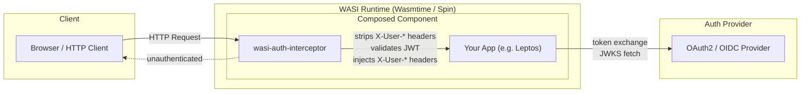

# WASI Auth Middleware

A modular, WebAssembly-compatible (WASI Preview 2) authentication framework for Rust.
Provides JWT session management, OAuth2/OIDC client logic, email OTP flows, and a
composable HTTP proxy middleware — all targeting `wasm32-wasip2`.

## Architecture


```mermaid
graph LR
    subgraph Client
        Browser["Browser / HTTP Client"]
    end

    subgraph "WASI Runtime (Wasmtime / Spin)"
        subgraph Composed["Composed Component"]
            Interceptor["wasi-auth-interceptor"]
            App["Your App (e.g. Leptos)"]
        end
    end

    subgraph External["Auth Provider"]
        OAuth["OAuth2 / OIDC Provider"]
    end

    Browser -- "HTTP Request" --> Interceptor
    Interceptor -- "strips X-User-* headers\nvalidates JWT\ninjects X-User-* headers" --> App
    Interceptor -. "unauthenticated" .-> Browser
    App -- "token exchange\nJWKS fetch" --> OAuth
```

### Request Flow

1. **Incoming request** hits the `wasi-auth-interceptor` component
2. **Header stripping** — all `X-User-*` headers are removed to prevent spoofing
3. **Public path bypass** — requests to `/`, `/login`, `/pkg/*`, `/static/*` are forwarded without auth
4. **JWT validation** — extracts JWT from cookies or `Authorization: Bearer` header and verifies it
5. **Header injection** — on success, injects `X-User-Id`, `X-User-Roles`, `X-User-Email`, `X-User-Name`
6. **Forwarding** — authenticated request is passed to the downstream application component
7. **Rejection** — unauthenticated mutating requests get `401 Unauthorized`; unauthenticated `GET` requests get `302 → /login`

## Prerequisites

### Rust Toolchain

| Requirement          | Version          |
|----------------------|------------------|
| Rust edition         | `2024`           |
| Rust stable channel  | ≥ 1.93.0         |
| WASI target          | `wasm32-wasip2`  |

```bash
# Install the WASI target
rustup target add wasm32-wasip2
```

### CLI Tools

| Tool           | Install Command                  | Purpose                                      |
|----------------|----------------------------------|----------------------------------------------|
| **Wasmtime**   | [wasmtime.dev](https://wasmtime.dev/) (≥ 45.0.0) | Serves composed WASI components       |
| **wac-cli**    | `cargo install wac-cli`          | Links/composes WASI components together       |
| **wasm-tools** | `cargo install wasm-tools`       | Inspects and manipulates Wasm binaries        |
| **just**       | `cargo install just`             | Task automation and run commands             |

### Key Dependency Versions

The following crate versions are required for WASI compatibility:

| Crate            | Version   | Notes                                    |
|------------------|-----------|------------------------------------------|
| `wasi`           | `0.14.7`  | WASI Preview 2 bindings                  |
| `wit-bindgen`    | `0.33.0`  | WIT binding code generation              |
| `rsa`            | `0.9`     | Pure-Rust RSA for JWT signing            |
| `sha2`           | `0.10`    | SHA-256 hashing for JWT                  |
| `leptos`         | `0.8.9`   | Leptos framework (example/integration)   |
| `leptos_wasi`    | `0.3.x`   | WASI integration for Leptos (external)   |

> **Note:** The `leptos-auth-demo` example depends on [`leptos_wasi`](https://github.com/leptos-rs/leptos_wasi)
> which must be cloned separately at the path `../../../leptos_wasi` relative to the example crate.

## Workspace Crates

```
wasi-auth-middleware/
├── wasi-auth-traits/          # Core trait abstractions & storage backends
├── wasi-auth-core/            # JWT engine, OAuth2 client, OTP & WebAuthn flows
├── leptos-wasi-auth/          # Leptos framework integration
├── wasi-auth-providers/       # OAuth2 client configurations & presets
├── leptos-wasi-ui/            # Configurable Leptos UI auth components
├── wasi-auth-interceptor/     # Standalone WASI HTTP proxy middleware
├── examples/
│   └── leptos-auth-demo/      # Example Leptos SSR app with auth
└── tests/
    ├── mock-auth-server/      # Mock OAuth2 & email HTTP server
    └── e2e-runner/            # E2E test orchestrator
```

### `wasi-auth-traits`

Defines the core abstractions that all other crates depend on:

- **`AuthStorage`** trait — session, OTP, TOTP secret, and JTI blacklist persistence (store, get, delete, verify).
- **`EmailSender`** trait — email delivery abstraction.
- **`RateLimiter`** trait & **`InMemoryRateLimiter`** APIs — thread-safe sliding window rate-limiting for OTP dispatches and login requests:
  - `check_rate_limit(key, action)`: Checks if an action is allowed within the window.
  - `record_action(key, action)`: Increments the rate limit counter and logs the attempt.
  - Preconfigured actions: `"send_otp"` (default limit: 5), `"verify_otp"` (default limit: 10).
- **Backends:**
  - `InMemoryStorage` — thread-safe `RwLock<HashMap>` (always available).
  - `SpinKeyValueStorage` — Spin SDK key-value store (feature: `spin`).
  - `SQLiteStorage` — Spin SDK SQLite database (feature: `sqlite`).
  - `StdoutEmail` — prints to stdout (development).
  - `HttpEmail` — sends via HTTP POST (feature: `http-email`).

### `wasi-auth-core`

The core authentication engine:

- **JWT** — pure-Rust RS256 JWT generation and verification using `rsa` + `sha2` (no `jsonwebtoken` crate dependencies on WebAssembly).
- **OAuth2** — client for authorization code flow, token exchange, userinfo, and OIDC discovery.
- **OTP** — 6-digit email one-time password generation, storage, and verification.
- **TOTP** — Time-based One-Time Passwords (RFC 6238) with ±1 step drift tolerance and Base32 encoding/decoding.
- **Magic Links** — passwordless signed JWT login with single-use replay protection via JTI blacklisting.
- **Passkey WebAuthn APIs** — Helper functions wrapping the `passkey-server` engine to integrate WebAuthn:
  - `start_passkey_registration(store, user_id, username, display_name, config, now_ms)`: Generates registration challenge options.
  - `finish_passkey_registration(store, user_id, config, response, now_ms)`: Cryptographically verifies the registration response and persists the credential.
  - `start_passkey_login(store, config, now_ms)`: Generates login assertion options.
  - `finish_passkey_login(store, config, response, now_ms)`: Validates the assertions, checks the signature counter (preventing cloning attacks), and returns the user ID.

### `leptos-wasi-auth`

Integrates the auth framework with [Leptos](https://leptos.dev):

- **Dual-mode authentication:**
  - *Gateway mode* — trusts `X-User-*` headers injected by the interceptor.
  - *Library mode* — directly extracts and verifies JWT from cookies or `Authorization` header.
- **Leptos context** — `provide_session_context()`, `expect_session()`, `expect_role()` guards.
- **Feature flags:** `ssr` (default), `hydrate`, `csr`, `unsafe-dev-fallback`, `leptos`.

### `wasi-auth-providers`

Provides ready-to-use client presets for external OIDC/OAuth2 integrations:

- **Client Presets**: Google (`google::google`), GitHub (`github::github`), Apple (`apple::apple`), Microsoft (`microsoft::microsoft`), Facebook (`facebook::facebook`), Discord (`discord::discord`), X (`x::x`), and Keycloak (`keycloak::keycloak`).
- **Feature Flags**: Add presets selectively using features: `google`, `github`, `apple`, `microsoft`, `facebook`, `discord`, `x`, `keycloak`, or `all` to enable all presets.
- **Mock & Custom Integrations**: Supports local debugging against the `mock-auth-server` and custom database backends (e.g. SQLite, Spin KV) via storage traits.

### `leptos-wasi-ui`

Premium, configurable, styled Leptos components for authentication workflows:

- **UI Components**:
  - `LoginForm`: A tabbed sign-in component supporting Email OTP, Magic Link request, and MFA TOTP verification. It can also render passkey login and OAuth provider buttons.
  - `OtpForm`: A code entry form that requests and verifies One-Time Passwords.
  - `MagicLinkForm`: Request form for passwordless magic links.
  - `TotpSetup`: A step-by-step wizard showing secrets, provisioning URI/QR data, and verifying the initial code.
  - `MfaStatus`: Displays active MFA status (enabled/disabled) with action callbacks.
  - `SessionList`: Lists active user sessions and provides a "revoke" button.
  - `PasskeyRegisterButton` / `PasskeyLoginButton`: Buttons that trigger browser WebAuthn ceremonies (using JS/WASM interop).
  - `PasskeyList` (under the `passkey` feature): Lists registered passkeys, allowing rename and deletion operations.
- **Feature Flags**:
  - `ssr`: Server-side rendering support.
  - `hydrate`: WebAuthn browser API linking during client-side hydration.
  - `csr`: Client-side rendering support.
  - `passkey`: Enables passkey management list and integrations.

### `wasi-auth-interceptor`

Standalone WASI HTTP middleware component:

- Exports and imports `wasi:http/incoming-handler@0.2.9`.
- Composable via `wac plug` with any downstream WASI component.
- Strips, validates, and injects authentication headers.
- Configurable via environment variables and TOML configurations.

## Quick Start

### Build

```bash
# Build all workspace crates for the host (tests, mock server)
cargo build --workspace

# Build WASI components
cargo build -p wasi-auth-interceptor --target wasm32-wasip2 --release
cargo build -p leptos-auth-demo --target wasm32-wasip2 --release
```

### Compose Components

Use `wac` to compose the interceptor with a downstream app:

```bash
wac plug \
  target/wasm32-wasip2/release/wasi_auth_interceptor.wasm \
  --plug target/wasm32-wasip2/release/leptos_auth_demo.wasm \
  -o composed.wasm
```

### Serve

```bash
wasmtime serve composed.wasm \
  --addr 127.0.0.1:8080 \
  --wasi inherit-network \
  --env JWT_PUBLIC_KEY="$(cat public_key.pem)" \
  --env JWT_AUDIENCE="my-app" \
  --env JWT_ISSUER="my-auth-server"
```

### Test

```bash
# Run all workspace formatting, clippy lints, and test checks:
just check

# Run individual examples (e.g. totp, magic_link, oauth, otp, storage_backends):
just example <name>
```

## Configuration & Environment Variables

### Interceptor (`wasi-auth-interceptor`)

The interceptor reads configuration from environment variables and an optional TOML configuration file.

#### Environment Variables

| Variable | Required | Default | Description |
|---|---|---|---|
| `JWT_PUBLIC_KEY` | No* | None | PEM-encoded RSA public key for cryptographic signature verification. |
| `JWT_AUDIENCE` | No* | None | Expected JWT `aud` claim value. |
| `JWT_ISSUER` | No* | None | Expected JWT `iss` claim value. |
| `WASI_AUTH_CONFIG` | No | `wasi-auth.toml` | File path to load the TOML configuration block. |
| `WASI_AUTH_PUBLIC_PATHS` | No | *(see default)* | Comma-separated list of paths/patterns bypassing authentication. |
| `WASI_AUTH_LOGIN_REDIRECT` | No | `/login` | URL to redirect unauthenticated GET requests to. |

> **\* Silent Unsafe JWT Verification Fallback Condition:** If **any** of the cryptographic verification environment variables (`JWT_PUBLIC_KEY`, `JWT_AUDIENCE`, or `JWT_ISSUER`) are missing or blank, the interceptor silently falls back to **unsafe JWT parsing**. In this mode, the JWT claims payload is decoded without signature validation, but token expiration (`exp`) is still checked (with a 60-second grace window). This is strictly for development and testing.

#### TOML Configuration

By default, the interceptor searches for `wasi-auth.toml` (overridden by `WASI_AUTH_CONFIG`). 

- **`[auth]` Section (Supported)**:
  - `public_paths` (array of strings): Paths matching these patterns bypass verification.
  - `login_redirect` (string): Redirect location for unauthenticated requests.
- **`[jwt]` Section (Ignored)**:
  - Properties under `[jwt]` (e.g. `public_key_path`, `audience`, `issuer`) are parsed into the config struct but **ignored** during runtime verification. Cryptographic JWT verification requires the `JWT_PUBLIC_KEY`, `JWT_AUDIENCE`, and `JWT_ISSUER` environment variables to be set.

#### Default Public Paths

If no custom public paths are provided, the interceptor defaults to:
- `/`
- `/login`
- `/signup`
- `/pkg/*` (static WASM/JS web bundles)
- `/static/*` (assets, CSS, images)
- `/health` (health check endpoints)

### Leptos Integration (`leptos-wasi-auth`)

| Variable                       | Default | Description                                      |
|--------------------------------|---------|--------------------------------------------------|
| `TRUST_PROXY_HEADERS`          | `false` | Trust `X-User-*` headers from upstream proxy     |
| `WASI_AUTH_TRUST_PROXY_HEADERS`| `false` | Alias for `TRUST_PROXY_HEADERS`                  |

## Authentication Modes

### 1. Gateway Mode (Interceptor + App)

The interceptor sits in front of your app as a composed WASI component. It handles all JWT
verification and injects trusted `X-User-*` headers. Your app reads these headers via
`leptos-wasi-auth` with `TRUST_PROXY_HEADERS=true`.

```
Browser → [Interceptor: validate JWT, inject headers] → [App: read X-User-* headers]
```

### 2. Library Mode (Direct JWT)

Your app verifies JWTs directly without the interceptor. `leptos-wasi-auth` extracts the token from
cookies or the `Authorization` header and verifies it against provided RSA keys.

```
Browser → [App: extract JWT from cookie/header, verify signature, build session]
```

## Cookie Precedence

When extracting JWT tokens from cookies, the following precedence order is used (highest to lowest):

| Priority | Cookie Name         | Security Level        |
|----------|---------------------|-----------------------|
| 1        | `__Host-jwt`        | Highest (host-bound)  |
| 2        | `__Host-session`    | Host-bound            |
| 3        | `__Secure-jwt`      | Secure (HTTPS-only)   |
| 4        | `__Secure-session`  | Secure                |
| 5        | `jwt`               | Standard              |
| 6        | `session`           | Lowest                |

## Header Injection

Authenticated requests forwarded by the interceptor include these headers:

| Header          | Value                          | Example                  |
|-----------------|--------------------------------|--------------------------|
| `X-User-Id`     | JWT `sub` claim                | `user_12345`             |
| `X-User-Roles`  | Comma-separated JWT `roles`    | `user,admin`             |
| `X-User-Email`  | JWT `email` claim              | `alice@example.com`      |
| `X-User-Name`   | JWT `name` claim               | `Alice Smith`            |

> **Security:** The interceptor **always** strips these headers from incoming requests before
> processing to prevent header spoofing attacks.

## Testing

Run all unit, integration, and E2E checks with formatting and clippy rules verified:
```bash
just check
```

## License

MIT OR Apache-2.0
