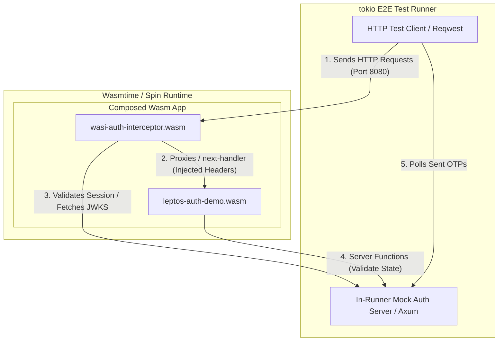

# WASI Authentication & Middleware Framework — E2E Testing Infrastructure

This document describes the design, setup, and execution of the End-to-End (E2E) integration test suite for the WASI Authentication & Middleware Framework.

## 1. Test Architecture Diagram

Below is the interaction layout between the E2E Test Runner, the Mock Services, and the composed Wasm application served inside the Wasmtime/Spin runtime environment:



### Flow Execution Overview
1. **Compilation**: The test runner compiles the crates in the monorepo to the `wasm32-wasip2` target.
2. **Composition**: The runner executes WebAssembly Composer (`wac`) to link `wasi-auth-interceptor` (acting as the proxy entry point) and `examples/leptos-auth-demo` (downstream application component).
3. **Mocks Launch**: The runner starts an in-runner HTTP mock server (Axum) on a tokio thread.
4. **Target App Launch**: The runner spawns `wasmtime serve` or `spin up` pointing to the composed component, configuring allowed outbound network hosts to access the mock server.
5. **Validation**: The test client executes HTTP requests to verify routing, redirects, session persistence, header injection, spoofing prevention, and OTP verification.

---

## 2. Prerequisites & Setup

Ensure the following tools are installed on your system:

### Rust Toolchain
Install the Rust toolchain (stable) and add the WebAssembly WASI target:
```bash
rustup target add wasm32-wasip2
```

### WebAssembly Composer (`wac`)
`wac` is used to link independent Wasm components:
```bash
cargo install wac-cli
```

### Wasmtime CLI (or Spin CLI)
- **Wasmtime CLI** (>= 45.0.0) is used to serve the composed component.
- **Spin CLI** (>= 4.0.0) is used for testing key-value and SQLite storage backends.

---

## 3. How to Run the Complete E2E Suite

The E2E test runner automatically orchestrates compiling, composing, spawning dependencies, running the test scenarios, and executing cleanup.

### Run via Cargo Test
To execute the integration tests, run the following command from the workspace root:
```bash
cargo test -p e2e-runner -- --nocapture
```

### Run via Cargo Run
Alternatively, you can run the runner binary directly:
```bash
cargo run --bin e2e-runner
```

### Running Specific Test Tiers
To isolate execution to specific test categories (Tiers 1-4):
```bash
# Run Tier 1 (Feature Coverage) only
cargo test -p e2e-runner -- test_tier_1

# Run Tier 2 (Boundary & Corner Cases) only
cargo test -p e2e-runner -- test_tier_2

# Run Tier 3 (Cross-Feature Combinations) only
cargo test -p e2e-runner -- test_tier_3

# Run Tier 4 (Real-World Scenarios) only
cargo test -p e2e-runner -- test_tier_4
```

---

## 4. Mock Services Reference

To keep the test suite hermetic, the runner starts an Axum-based HTTP server inside the test runner process. This allows shared, in-memory state inspection between tests and mock endpoints.

### A. OAuth2 Provider Endpoints
The mock server simulates multiple identity providers (Google, Facebook, X, and Custom OIDC):
- **`GET /oauth/authorize`**: Mock consent endpoint. Parses input parameters, validates the `state` parameter to prevent CSRF, and redirects the browser back to `/callback` with a temporary authorization code.
- **`POST /oauth/token`**: Receives authorization codes and trades them for signed JWT tokens (ID/Access tokens).
- **`GET /.well-known/jwks.json`**: Serves the JSON Web Key Set (JWKS) containing the mock public keys used to verify token signatures.
- **`GET /oauth/userinfo`**: Returns mock user profiles associated with the token.

### B. Email OTP Sink Endpoints
- **`POST /email/send`**: Mock target for HTTP-based email delivery. Saves sent emails and OTP codes in-memory.
- **`GET /email/inbox?to=<email>`**: Inspection API for the test runner to fetch the most recent OTP code sent to `<email>`.
- **`DELETE /email/inbox`**: Resets the in-memory mailbox between test cases.

### C. Fault Injection Control API
For testing boundary/corner cases (Tier 2):
- **`POST /mock/configure-behavior`**: Configures the mock server to inject failures (e.g., rotate JWKS, simulate database lockups, expire JWKS signatures, return error callbacks, or inject network latency).

---

## 5. Directory Layout

The workspace is organized as follows:
```
.
├── Cargo.toml                  # Workspace manifest
├── PROJECT.md                  # Project overview and contracts
├── TEST_INFRA.md               # This E2E documentation
├── wasi-auth-traits/           # Trait definitions (AuthStorage, EmailSender)
├── wasi-auth-core/             # Core logic (JWT verification, OTP gen, OAuth)
├── leptos-wasi-auth/           # Leptos SDK and route guards
├── wasi-auth-interceptor/      # Standalone WASI proxy middleware component
├── examples/
│   └── leptos-auth-demo/       # Example downstream Leptos app
└── tests/
    ├── e2e-runner/             # Rust E2E runner orchestrator & mock runner
    │   ├── Cargo.toml
    │   └── src/main.rs
    └── mock-auth-server/       # Mock OAuth2 & Email HTTP server codebase
        ├── Cargo.toml
        └── src/main.rs
```

---

## 6. Troubleshooting & Common Issues

### Address Already in Use
- **Symptom**: `std::io::Error: Address already in use (os error 98/48)`
- **Cause**: Port `8080` (composed component), `8081` (mock OAuth2 server), or `8082` (mock email server) is currently in use.
- **Solution**: Identify the running processes and terminate them. The E2E Test Runner assigns random ports on localhost during parallel execution; if hardcoded ports are used, ensure they are free.

### Outbound Network Settings (Allowed Host Restriction)
- **Symptom**: Guest component fails to connect to mock services on `localhost`.
- **Cause**: WASI Preview 2 denies all network requests by default. The host runtime must explicitly authorize access to mock endpoints.
- **Solution**: Ensure Wasmtime/Spin is launched with the correct outbound network access configuration. For Wasmtime:
  `--wasi-http-config allowed-outbound-hosts=127.0.0.1:MOCK_PORT`
  For Spin:
  Verify `allowed_outbound_hosts = ["http://127.0.0.1:MOCK_PORT"]` is set in your `spin.toml`.

### WAC Composition Mismatch
- **Symptom**: `error: component does not export interface...` or type signature validation failed during `wac compose`.
- **Cause**: Interface mismatch between `wasi-auth-interceptor` (proxy) and `leptos-auth-demo` (downstream).
- **Solution**: Run `wac list <component.wasm>` on both compiled components to inspect their imported and exported interfaces. Ensure both utilize identical WIT interface definitions and version numbers (e.g. `wasi:http/incoming-handler@0.2.0`).
