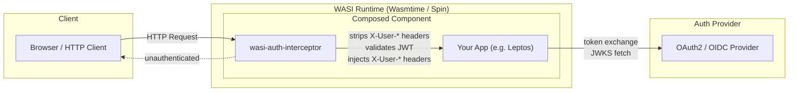

# Architecture

This document serves as a high-level conceptual reference for system architects and developers wanting to understand how the WASI component model composition acts on requests, how the modular crates are divided, and the details of JWT signature validation, proxy routing, custom storage/email abstractions, and MFA / WebAuthn flows.

---

## Architecture Diagram

The diagram below showcases the interaction between the Client, the WASI Runtime (such as Wasmtime or Spin) hosting the composed component, and the External Auth Provider.



---

## Request Flow

1. **Incoming request** hits the `wasi-auth-interceptor` component.
2. **Header stripping** — all `X-User-*` headers are removed to prevent spoofing.
3. **Public path bypass** — requests to public paths (e.g., `/`, `/login`, `/pkg/*`, `/static/*`) are forwarded without authentication.
4. **JWT validation** — extracts the JWT from cookies or the `Authorization: Bearer` header and verifies it.
5. **Header injection** — on successful validation, injects identity headers: `X-User-Id`, `X-User-Roles`, `X-User-Email`, `X-User-Name`.
6. **Forwarding** — the authenticated request is passed to the downstream application component.
7. **Rejection** — unauthenticated mutating requests (e.g., POST, PUT, DELETE) receive a `401 Unauthorized` response, while unauthenticated `GET` requests are redirected with a `302 Found` status to `/login`.

---

## Workspace Crates Directory & Descriptions

The layout of the `wasi-auth-middleware` repository is divided into modular crates:

```
wasi-auth-middleware/
├── wasi-auth-traits/          # Core trait abstractions & storage backends
├── wasi-auth-core/            # JWT engine, OAuth2 client, OTP & WebAuthn flows
├── leptos-wasi-auth/          # Leptos framework integration
├── wasi-auth-providers/       # OAuth2 client configurations & presets
├── leptos-wasi-ui/            # Configurable Leptos UI auth components
├── wasi-auth-interceptor/     # Standalone WASI HTTP proxy middleware
├── examples/
│   └── leptos-auth-demo/      # Example Leptos SSR app with auth
└── tests/
    ├── mock-auth-server/      # Mock OAuth2 & email HTTP server
    └── e2e-runner/            # E2E test orchestrator
```

### `wasi-auth-traits`

Defines the core abstractions that all other crates depend on:

- **`AuthStorage`** trait — session, OTP, TOTP secret, and JTI blacklist persistence (store, get, delete, verify).
- **`EmailSender`** trait — email delivery abstraction.
- **`RateLimiter`** trait & **`InMemoryRateLimiter`** APIs — thread-safe sliding window rate-limiting for OTP dispatches and login requests:
  - `check_rate_limit(key, action)`: Checks if an action is allowed within the window.
  - `record_action(key, action)`: Increments the rate limit counter and logs the attempt.
  - Preconfigured actions: `"send_otp"` (default limit: 5), `"verify_otp"` (default limit: 10).
- **Backends:**
  - `InMemoryStorage` — thread-safe `RwLock<HashMap>` (always available).
  - `SpinKeyValueStorage` — Spin SDK key-value store (feature: `spin`).
  - `SQLiteStorage` — Spin SDK SQLite database (feature: `sqlite`).
  - `StdoutEmail` — prints to stdout (development).
  - `HttpEmail` — sends via HTTP POST (feature: `http-email`).

### `wasi-auth-core`

The core authentication engine:

- **JWT** — pure-Rust RS256 JWT generation and verification using `rsa` + `sha2` (no `jsonwebtoken` crate dependencies on WebAssembly).
- **OAuth2** — client for authorization code flow, token exchange, userinfo, and OIDC discovery.
- **OTP** — 6-digit email one-time password generation, storage, and verification.
- **TOTP** — Time-based One-Time Passwords (RFC 6238) with ±1 step drift tolerance and Base32 encoding/decoding.
- **Magic Links** — passwordless signed JWT login with single-use replay protection via JTI blacklisting.
- **Passkey WebAuthn APIs** — Helper functions wrapping the `passkey-server` engine to integrate WebAuthn:
  - `start_passkey_registration(store, user_id, username, display_name, config, now_ms)`: Generates registration challenge options.
  - `finish_passkey_registration(store, user_id, config, response, now_ms)`: Cryptographically verifies the registration response and persists the credential.
  - `start_passkey_login(store, config, now_ms)`: Generates login assertion options.
  - `finish_passkey_login(store, config, response, now_ms)`: Validates the assertions, checks the signature counter (preventing cloning attacks), and returns the user ID.

### `leptos-wasi-auth`

Integrates the auth framework with [Leptos](https://leptos.dev):

- **Dual-mode authentication:**
  - *Gateway mode* — trusts `X-User-*` headers injected by the interceptor.
  - *Library mode* — directly extracts and verifies JWT from cookies or `Authorization` header.
- **Leptos context** — `provide_session_context()`, `expect_session()`, `expect_role()` guards.
- **Feature flags:** `ssr` (default), `hydrate`, `csr`, `unsafe-dev-fallback`, `leptos`.

### `wasi-auth-providers`

Provides ready-to-use client presets for external OIDC/OAuth2 integrations:

- **Client Presets**: Google (`google::google`), GitHub (`github::github`), Apple (`apple::apple`), Microsoft (`microsoft::microsoft`), Facebook (`facebook::facebook`), Discord (`discord::discord`), X (`x::x`), and Keycloak (`keycloak::keycloak`).
- **Feature Flags**: Add presets selectively using features: `google`, `github`, `apple`, `microsoft`, `facebook`, `discord`, `x`, `keycloak`, or `all` to enable all presets.
- **Mock & Custom Integrations**: Supports local debugging against the `mock-auth-server` and custom database backends (e.g. SQLite, Spin KV) via storage traits.

### `leptos-wasi-ui`

Premium, configurable, styled Leptos components for authentication workflows:

- **UI Components**:
  - `LoginForm`: A tabbed sign-in component supporting Email OTP, Magic Link request, and MFA TOTP verification. It can also render passkey login and OAuth provider buttons.
  - `OtpForm`: A code entry form that requests and verifies One-Time Passwords.
  - `MagicLinkForm`: Request form for passwordless magic links.
  - `TotpSetup`: A step-by-step wizard showing secrets, provisioning URI/QR data, and verifying the initial code.
  - `MfaStatus`: Displays active MFA status (enabled/disabled) with action callbacks.
  - `SessionList`: Lists active user sessions and provides a "revoke" button.
  - `PasskeyRegisterButton` / `PasskeyLoginButton`: Buttons that trigger browser WebAuthn ceremonies (using JS/WASM interop).
  - `PasskeyList` (under the `passkey` feature): Lists registered passkeys, allowing rename and deletion operations.
- **Feature Flags**:
  - `ssr`: Server-side rendering support.
  - `hydrate`: WebAuthn browser API linking during client-side hydration.
  - `csr`: Client-side rendering support.
  - `passkey`: Enables passkey management list and integrations.

### `wasi-auth-interceptor`

Standalone WASI HTTP middleware component:

- Exports and imports `wasi:http/incoming-handler@0.2.9`.
- Composable via `wac plug` with any downstream WASI component.
- Strips, validates, and injects authentication headers.
- Configurable via environment variables and TOML configurations.

---

## Authentication Modes

The framework supports two integration topologies depending on how you want to manage request processing:

### 1. Gateway Mode (Interceptor + App)

The interceptor sits in front of your app as a composed WASI component. It handles all JWT verification and injects trusted `X-User-*` headers. Your app reads these headers via `leptos-wasi-auth` with `TRUST_PROXY_HEADERS=true` enabled.

```
Browser → [Interceptor: validate JWT, inject headers] → [App: read X-User-* headers]
```

### 2. Library Mode (Direct JWT)

Your app verifies JWTs directly without the interceptor proxy. `leptos-wasi-auth` extracts the token from cookies or the `Authorization` header and verifies it against provided RSA keys in-process.

```
Browser → [App: extract JWT from cookie/header, verify signature, build session]
```

---

## Header Injection & Security Boundaries

When running in **Gateway Mode**, the interceptor is responsible for enforcing the security boundary:

- **Incoming request stripping**: The interceptor **always** strips all `X-User-*` headers from incoming requests before processing. This prevents clients from spoofing identity headers.
- **Header Injection**: Upon successful JWT validation, the interceptor injects the following headers into the forwarded request:

| Header          | Value                          | Example                  |
|-----------------|--------------------------------|--------------------------|
| `X-User-Id`     | JWT `sub` claim                | `user_12345`             |
| `X-User-Roles`  | Comma-separated JWT `roles`    | `user,admin`             |
| `X-User-Email`  | JWT `email` claim              | `alice@example.com`      |
| `X-User-Name`   | JWT `name` claim               | `Alice Smith`            |

---

## Custom Storage & Email Abstractions

The framework is decoupled from any specific storage engine or transport protocol through Rust traits defined in `wasi-auth-traits`:

- **`AuthStorage`**: Swapping out this trait allows developers to run on different database/caching engines (such as Redis, DynamoDB, PostgreSQL, or SQLite). It provides interfaces to persist user sessions, map OTPs, store base32 TOTP secrets, and blacklist JWT JTIs.
- **`EmailSender`**: Swapping out this trait lets the developer route transactional emails (OTP codes, magic link URLs) via external email delivery networks (like SendGrid or AWS SES) or output them to stdout/logs during local development.

---

## MFA, Magic Links, & WebAuthn / Passkeys Flow Design

### 1. TOTP Flow Design
Time-based One-Time Passwords (RFC 6238) provide a secondary security layer. The server generates a random base32-encoded secret, registers it in the `AuthStorage` for the user, and constructs a standard provisioning URI (`otpauth://...`). When verifying, the server checks the submitted code against the current and adjacent time-steps (±1 window drift tolerance) to account for client-server clock desynchronization, subsequently enforcing single-use replay protection.

### 2. Magic Links Flow Design
Magic Links enable passwordless authentication via short-lived signed JWTs. When a user requests a link, the server generates a JWT containing a unique JTI claim and sends it to the user's email. When the callback route consumes the token, the signature and expiration are verified, and the JTI is checked against the JTI blacklist. If not blacklisted, the JTI is added to the blacklist to prevent replay attacks, and a valid session is created.

### 3. WebAuthn / Passkeys Flow Design
WebAuthn (Passkeys) uses asymmetric cryptography to eliminate password-based security vulnerabilities:
- **Registration Flow**:
  1. The server generates `PublicKeyCredentialCreationOptions` (including a cryptographic challenge, relying party ID, user information, and cryptographic parameters) and caches the challenge.
  2. The client browser triggers the WebAuthn API (`navigator.credentials.create()`) via the authenticator (e.g., FaceID, TouchID, YubiKey).
  3. The server cryptographically validates the signed response (attestation signature, challenge verification) and persists the public key and credentials in the credential store.
- **Assertion/Login Flow**:
  1. The server generates `PublicKeyCredentialRequestOptions` (including a challenge and allowed credential IDs).
  2. The client browser prompts the authenticator to sign the assertion via `navigator.credentials.get()`.
  3. The server validates the assertions, checks the signature counter to detect cloning attacks, and associates the validated key with the authenticated user session.

### 4. Sliding Rate-Limiter Windows
To protect brute-forceable authentication endpoints, the `RateLimiter` trait enables sliding window rate limiting. The default `InMemoryRateLimiter` logs each action timestamp within a rolling window (e.g., 900 seconds) and rejects incoming requests once the limit is exceeded. Preconfigured rate-limit profiles protect sensitive actions:
- `"send_otp"`: Limited to 5 requests per window.
- `"verify_otp"`: Limited to 10 requests per window.
